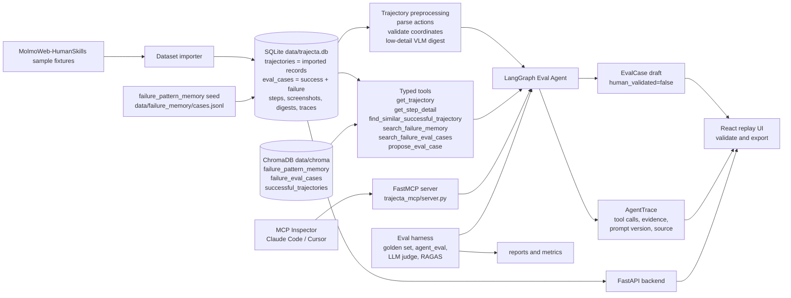
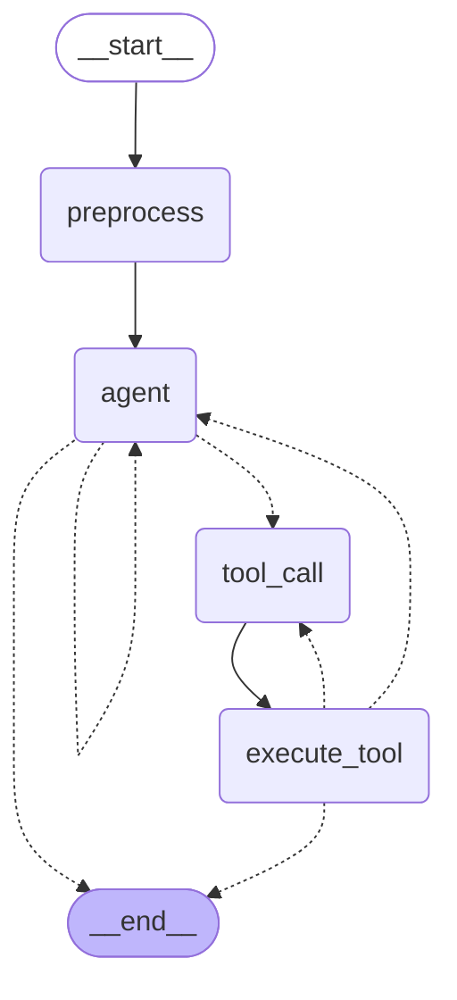

# Trajecta

Trajecta turns raw browser-agent trajectories into human-validated regression eval cases.

Trajecta is an AI-native Eval Agent for browser-agent trajectory evaluation. It imports recorded browser-agent trajectories, replays screenshots and actions, uses a LangGraph tool-calling agent to inspect suspicious steps, retrieves similar failures from ChromaDB, and produces eval case drafts that humans review before export.

This is not a browser-use agent. It does not control a live browser in v1.

## Demo

Full walkthrough — import a trajectory, preprocess, run the Eval Agent, and validate an eval case (6 min):

https://github.com/user-attachments/assets/4e4074d4-7740-42ee-941a-c48bb6f4faa0


## Presentation Guide

Use this README as the presentation entry point:

1. **Problem** - browser-control agents and trajectory datasets exist, but teams still need a repeatable way to diagnose recorded failures and turn them into regression eval cases.
2. **System architecture** - walk through the diagram below: imported trajectories, preprocessing, RAG, tool-calling Eval Agent, UI, MCP, and eval harness.
3. **UI demo** - import the bundled MolmoWeb sample, select a run, replay screenshots/actions, click `Analyze Trajectory`, inspect the trace, validate/export the draft.
4. **MCP demo** - show Trajecta as a remote callable composite tool through MCP Inspector or a coding-agent client.
5. **Experiments** - show the golden set, v1 to v5 prompt iteration, dual LLM judge agreement, RAGAS result, VLM cost savings, and pytest status.
6. **Boundaries** - v1 closes on trajectory evaluation only: no live browser control, no recorder middleware, no reviewer UI, no security benchmark, no v2 backlog work.

## Architecture



### Eval Agent graph (LangGraph)

Auto-generated from the compiled graph (`_compiled_graph(...).get_graph().draw_mermaid()` in `backend/app/eval_agent_graph.py`). Per-step preprocessing runs once, then the agent loops over tool calls until it emits `propose_eval_case` or hits the tool-call budget:



Core contracts live in [docs/contracts.md](docs/contracts.md). Behavior docs live in [docs/preprocessing.md](docs/preprocessing.md), [docs/eval_agent.md](docs/eval_agent.md), [docs/rag.md](docs/rag.md), [docs/api.md](docs/api.md), and [docs/architecture.md](docs/architecture.md).

Terminology note: `trajectory` is the canonical product term. Current public
API/tool names are now fully canonical (`trajectory_id`, `/api/trajectories`, `get_trajectory`, `trajectories` table). The word `run` survives only as `eval/runs/<timestamp>/`, one evaluation execution — not a trajectory.

## Quick Start

Backend:

```bash
cd backend
pip install -r requirements.txt
uvicorn app.main:app --reload
```

Frontend:

```bash
cd frontend
npm install
npm run dev
```

Open the Vite URL, then:

1. Click `Import Dataset` to load the bundled `data/raw/molmoweb_humanskills_sample/` fixture runs.
2. Select a trajectory from the left panel.
3. Replay screenshots, actions, observations, and coordinate validation.
4. Click `Analyze Trajectory` or `Analyze Selected Step`.
5. Review the Eval Agent trace, retrieved evidence, termination badge, and eval case draft.
6. Mark the reviewed draft validated, then export `eval_case.json`.

The app also runs cold without LLM credentials. When model env vars are unset, the backend uses deterministic mocks for the agent and VLM paths.

## Configuration

Local configuration is read from environment variables. Copy the template at the repo root, then edit secrets locally:

```bash
cp .env.example .env
```

Do not commit `.env`. Shell exports take precedence over the file. See [`.env.example`](.env.example) for the full variable list; the essentials are below.

```text
# Provider API keys — set one or both depending on which models you use.
# gemini-* models use GEMINI_API_KEY; all other model ids use OPENAI_API_KEY.
OPENAI_API_KEY=sk-...
GEMINI_API_KEY=your-gemini-key

# Optional: override the default API base URLs.
# OPENAI_BASE_URL=https://api.openai.com/v1
# GEMINI_BASE_URL=https://generativelanguage.googleapis.com/v1beta/openai/

# Tool-calling Eval Agent. Without this, OfflineAgentMock runs.
TRAJECTA_AGENT_MODEL=gpt-4o-mini
# or: TRAJECTA_AGENT_MODEL=gemini-3.1-flash-lite

# Low-detail preprocessing VLM + high-detail get_step_detail VLM.
# Without this, MockVLMClient runs.
TRAJECTA_VLM_MODEL=gpt-4o-mini
# or: TRAJECTA_VLM_MODEL=gemini-3.1-flash-lite

# Optional: versioned Eval Agent prompt bundle.
TRAJECTA_PROMPT_VERSION=v1_minimal

# Optional: versioned high-detail VLM prompt bundle.
TRAJECTA_VLM_HIGH_DETAIL_PROMPT_VERSION=v1_task_context

# Optional: Phase 8 dual LLM judge config.
TRAJECTA_JUDGE_A_MODEL=<gemini-model-id>
TRAJECTA_JUDGE_A_PROMPT_VERSION=<judge-a-prompt-version>
TRAJECTA_JUDGE_B_MODEL=<openai-model-id>
TRAJECTA_JUDGE_B_PROMPT_VERSION=<judge-b-prompt-version>

# Optional: model used by the RAGAS semantic metric (ragas_eval). Pick a model
# the OPENAI_API_KEY can serve that accepts `max_tokens` (e.g. gpt-4o-mini).
TRAJECTA_RAGAS_MODEL=gpt-4o-mini

# Optional: ChromaDB embedding model. Changing it requires rebuilding data/chroma/.
TRAJECTA_EMBEDDING_MODEL=text-embedding-3-small
```

Provider routing: `TRAJECTA_AGENT_MODEL` and `TRAJECTA_VLM_MODEL` each independently select their provider by model name prefix — `gemini-*` uses `GEMINI_API_KEY`; all other model ids use `OPENAI_API_KEY` + optional `OPENAI_BASE_URL`. Agent and VLM can use different providers (e.g., `TRAJECTA_AGENT_MODEL=gpt-4o-mini` + `TRAJECTA_VLM_MODEL=gemini-3.1-flash-lite`).

The two Gemini paths differ: the **VLM** uses Gemini's OpenAI-compatible endpoint (`GEMINI_BASE_URL`, default `…/v1beta/openai/`), while the **agent** uses the native `ChatGoogleGenerativeAI` (ignores `GEMINI_BASE_URL`). The native client is required for Gemini *thinking* models, which attach a `thought_signature` to each function call that must round-trip across multi-turn tool calls — supported only in `langchain-google-genai >= 3.0` (pinned `>= 4`), which is why the project is on the LangChain 1.x stack (`langchain-core >= 1.4` + the `google-genai` SDK). The 2.x line drops the signature and fails Gemini agent runs with a `400`. (The VLM is single-shot, so it has no such requirement and works on either line.)

Prompt updates are versioned directories under `prompts/eval_agent/`, `prompts/vlm_high_detail/`, and `prompts/judge/`. Create a new directory for each prompt change and roll back by setting the corresponding environment variable to a previous version. See [docs/prompt_versioning.md](docs/prompt_versioning.md).

Fallback behavior with no env vars set:

- `OfflineAgentMock` runs a deterministic 5-stage analysis script.
- `MockVLMClient` returns deterministic hash-derived summaries for low-detail and high-detail VLM calls.
- The default pytest suite exercises these offline paths.

Opt-in real LLM smoke (OpenAI):

```bash
OPENAI_API_KEY=sk-... TRAJECTA_AGENT_MODEL=gpt-4o-mini TRAJECTA_VLM_MODEL=gpt-4o-mini \
  pytest backend/tests/test_real_llm_integration.py -v
```

Opt-in real LLM smoke (Gemini):

```bash
GEMINI_API_KEY=your-gemini-key TRAJECTA_AGENT_MODEL=gemini-3.1-flash-lite TRAJECTA_VLM_MODEL=gemini-3.1-flash-lite \
  pytest backend/tests/test_real_llm_integration.py -v
```

These tests cost real provider tokens and are not part of the default suite.

## Eval & Experiments

Trajecta's evaluation story has four pillars: a structured golden set, deterministic pytest coverage, RAGAS over recorded retrieval traces, and a dual LLM judge with Cohen's κ agreement. See [docs/testing.md](docs/testing.md), [docs/experiment_log.md](docs/experiment_log.md), and [docs/failure_analysis.md](docs/failure_analysis.md).

### Headline Results

| Area | Result |
| --- | --- |
| Golden set | 35 cases across 8 categories: allrecipes, amazon, apple, arxiv, booking, github, google_flight, huggingface |
| Top headline accuracy | `v3_balanced_rubric` & `v6_guided_autonomy` tie at 80.6% binary verdict accuracy (v3 is the cheapest/fastest at that accuracy) |
| Featured prompt | `v6_guided_autonomy` — same accuracy with a cleaner evidence trail (70% of evidence from high-detail inspection) |
| Failure-sensitive prompt | `v5_constraint_verification` reached 100.0% failure recall and 78.6% step localization |
| Dual LLM judge | Gemini/OpenAI κ_LLM,LLM = 1.0 (both judges 20/31 acceptable) on the v6 run; see caveat below |
| RAGAS faithfulness | evidence-mode, real: 0.93 (n=10) and 0.96 (n=58), holds as the set scales ~6×. Measures whether the generated eval-case draft (its success/failure verdict + supporting claims) stays grounded in the evidence the agent actually saw — a grounding check, so no external answer key is needed |
| Coarse-to-fine VLM | 91.5% visual-token cost savings in the formal v3 run |
| Test suite | Last recorded Phase 8 full sweep: 440 passed / 1 skipped |

### Golden Set

`eval/golden.jsonl` contains 35 cases built from `data/triage_notes.csv` with schema `{input, expected_facts, forbidden_facts, tags}`. Rebuild or check it with:

```bash
python scripts/build_golden_jsonl.py --check
```

### Agent-Quality Evaluation

```bash
cd backend
OPENAI_API_KEY=sk-... TRAJECTA_AGENT_MODEL=gpt-4o-mini TRAJECTA_VLM_MODEL=gpt-4o-mini \
  python -m app.agent_eval --trace-dir eval/runs/$(date -u +%Y-%m-%dT%H-%M-%SZ)/traces
```

Produces `eval/agent_report.{json,md}` plus per-sample trace JSONs under the `--trace-dir`. The latest `eval/agent_report.*` stays local-only (`.gitignore`d). Formal experiment runs under `eval/runs/` are **whitelisted** in `.gitignore` (v1→v5, v6 mini, gpt-5.4 ablation); other timestamps remain local-only.

`agent_eval` retries transient provider failures per sample: 429, rate limit, timeout, and connection errors retry up to 3 times by default. Tune with `--max-retries`, `--retry-base-s`, and `--retry-max-s`.

Resume an interrupted formal eval with the same trace dump directory:

```bash
TRAJECTA_PROMPT_VERSION=v3_balanced_rubric \
python -m backend.app.agent_eval \
  --trace-dir eval/runs/2026-05-30T03-54-45Z/traces
```

Existing `{trajectory_id}.json` traces are reused and not billed again. The prompt version must match the trace metadata; mismatches fail fast to avoid mixing outputs from different prompt versions.

### Prompt Iteration

The formal v1 to v6 comparison uses 31 filtered golden-set samples with `gpt-5.4-mini-2026-03-17` for both the Eval Agent and VLM.

| Round | Prompt | Change | Metric delta | Conclusion |
| --- | --- | --- | --- | --- |
| 1 | `v1_minimal` | Minimal failure-shape instructions, no rubric. | Baseline binary accuracy 74.2%; success recall 58.8%; failure recall 92.9%. | Strong failure sensitivity, but too many successful trajectories are marked failed. |
| 2 | `v2_success_rubric` | Add explicit success-shape rubric. | Binary accuracy +3.2 pp; success recall +29.4 pp; failure recall -28.6 pp. | Success hallucinations drop, but the prompt becomes too conservative on failures. |
| 3 | `v3_balanced_rubric` | Balance success/failure criteria and tighten stop conditions. | Binary accuracy +3.2 pp vs v2; mean tool calls -0.68; latency -1.50 s. | Best headline accuracy at 80.6% with lower tool use. |
| 4 | `v4_search_strategy_rubric` | Clarify successful-run retrieval vs failure-memory retrieval. | Binary accuracy -6.5 pp; failure-type accuracy rises to 57.1%. | Retrieval guidance helps the advisory failure-type signal, not the headline metric. |
| 5 | `v5_constraint_verification` | Emphasize constraint evidence and failure verification. | Binary accuracy -6.5 pp; failure recall +14.3 pp to 100.0%; success recall -23.5 pp. | Best for catching failures, but not the best general prompt. |
| 6 | `v6_guided_autonomy` | Legible per-tool contract + explicit investigation freedom + burden-of-proof / `not_visible` evidence rules. | Binary accuracy 80.6% (= v3); success recall 82.4%; failure recall 78.6%; 70% of evidence cited from high-detail inspection. | Matches v3's headline while grounding more claims in high-detail reads. Current featured prompt. |

`v3_balanced_rubric` ties `v6_guided_autonomy` for the top headline accuracy (80.6%), and reaches it the cheapest and fastest:

| Metric | Value |
| --- | --- |
| Binary verdict accuracy | 80.6% |
| Failure-verdict recall | 85.7% |
| Success-verdict recall | 76.5% |
| Mean tool calls / run | 1.68 |
| Mean wall-clock latency / run | 9.96 s |
| Total cost (31 runs) | $1.022 |
| Coarse-to-fine VLM savings | 91.5% |

The current featured prompt is `v6_guided_autonomy` — it does not beat v3's headline accuracy (the two tie at 80.6%), but it matches it while grounding more claims in high-detail inspection and is the version carried through the dual-judge run:

| Metric | v6 value | vs v3 |
| --- | --- | --- |
| Binary verdict accuracy | 80.6% | = |
| Success-verdict recall | 82.4% | +5.9 pp |
| Failure-verdict recall | 78.6% | −7.1 pp |
| Failure-type top-1 accuracy | 50.0% | = |
| Failure step ±2 localization | 64.3% | −7.1 pp |
| Evidence cited from high-detail reads | 70% (73/105) | v3 not tracked |
| Mean tool calls / run | 1.39 | −0.29 |
| Mean wall-clock latency / run | 48.27 s | +38.3 s |
| Total cost (31 runs) | $1.103 | +$0.081 |
| Dual-judge acceptability | A & B 20/31, κ=1.0 | v3 not judged |

Caveat: this v6 report (run `2026-06-03T05-45-39Z`) predates later v6 prompt edits (`not_visible` / precedence rules); those were not re-run over the full 31-case set.

Optional **model ablation** on the same v6 prompt (VLM still `gpt-5.4-mini-2026-03-17`; artefact `eval/runs/2026-06-04T06-04-20Z/`):

| Metric | v6 + `gpt-5.4-2026-03-05` agent | v6 + mini agent |
| --- | --- | --- |
| Binary verdict accuracy | 67.7% | 80.6% |
| Success-verdict recall | 41.2% | 82.4% |
| Failure-verdict recall | 100.0% | 78.6% |
| Mean `get_step_detail` / run | 2.32 | 1.00 |
| Total cost (31 runs) | $4.577 | $1.103 |
| Dual-judge acceptable (A / B) | 16/31; 14/31 | 20/31; 20/31 |
| κ_LLM,LLM | 0.743 | 1.000 |

**Why the stronger model scored lower:** not because it “reasons worse”—because
it applies the success/failure threshold too aggressively. The two runs disagree
on 10 trajectories, and **all 10 flips go the same direction** (mini `success` →
gpt-5.4 `failed`); none reverse. Seven of those are gold-success runs gpt-5.4
false-fails (the three real ones it catches lift failure recall to 100%). The
false failures happen on **fully visible evidence** (`evidence_unavailable = 0`),
so it is not a “saw fewer pixels” effect—the VLM was unchanged (`gpt-5.4-mini`);
gpt-5.4 just re-reads the same evidence and over-verifies constraints. On the
failures it does flag it is actually *sharper* (failure-type 0.50 → 0.64, step
localization 0.64 → 0.93), confirming a verdict **calibration** shift—a
failure-sensitive direction resembling `v5_constraint_verification`—not a
reasoning regression. Cross-run cost is **not** a fair unit-price comparison
(list prices, tool depth, digest cache 8/31 vs 31/31 on preprocess), and the
extra cost is dollars only: gpt-5.4 was faster per trajectory (25.7 s vs 48.3 s).
Full interpretation:
[docs/experiment_log.md — Why gpt-5.4 did not improve headline accuracy](docs/experiment_log.md#why-gpt-54-did-not-improve-headline-accuracy).

The v5 prompt is intentionally failure-sensitive: failure recall reaches 100.0%, but success recall drops to 41.2%. Full per-round metrics and caveats are in [docs/experiment_log.md](docs/experiment_log.md).

### Dual LLM Judge

```bash
python -m backend.app.agent_eval \
  --trace-dir eval/runs/{timestamp}/traces \
  --judge
```

The judge scores one binary dimension: `acceptable_eval_case`, meaning whether the generated draft is acceptable as a reusable regression case. Judge A uses a Gemini-compatible provider/model configured by `TRAJECTA_JUDGE_A_MODEL`; Judge B uses an OpenAI-compatible provider/model configured by `TRAJECTA_JUDGE_B_MODEL`.

On the **v6 mini-agent** run (`2026-06-03T05-45-39Z`), Judge A
(`gemini-3.1-flash-lite`) and Judge B (`gpt-5.4-mini-2026-03-17`) each accept
20 / 31 drafts and agree on all 31 cases: κ_LLM,LLM = 1.0 (target ≥ 0.6 met).
Reaching this required fixing the `regression_case_usefulness` assertion,
which had been failing success-shape drafts for omitting the failure-only fields
they are contractually required to omit; the fix lifted κ from 0.674 to 1.0 and
was applied identically to both provider rubrics to keep the comparison valid.

On **v6 gpt-5.4-agent** traces (`2026-06-04T06-04-20Z`), the same judge pair
accepts fewer drafts (A 16/31, B 14/31) with κ = 0.743 (4 disagreements) — still
above the 0.6 target.

Caveat: κ=1.0 on the mini run reflects a largely objective checklist (verdict
shape, failure-type membership, evidence support) applied at temperature 0 over
n=31 — two competent models converging on a mechanical standard, not proof that
acceptability judgment is "solved." Expect κ < 1.0 on a larger or harder set or
when the underlying agent drafts are weaker.

Standalone judge rerun/debug path:

```bash
python -m eval.judge \
  --golden eval/golden.jsonl \
  --report eval/agent_report.json \
  --trace-dir eval/runs/{timestamp}/traces \
  --out eval/judge_report.json
```

Human second-judge workflow and reviewer UI are intentionally not part of V1.

### RAGAS

```bash
python -m backend.app.ragas_eval --trace-dir eval/runs/{timestamp}/traces \
  --context-mode evidence --metric faithfulness --limit 10
```

The semantic metric is RAGAS `faithfulness`: does the generated eval-case draft — its success/failure verdict and the supporting claims behind it — stay faithful to the evidence the agent actually inspected? Because Trajecta's RAG (failure-memory / eval-case retrieval) is *auxiliary precedent* rather than the source of the agent's claims, the default `--context-mode evidence` builds the faithfulness `contexts` from what the agent actually inspected — its high-detail `get_step_detail` reads, the trajectory digest, and any retrieved precedent — not from Chroma hits alone. So faithfulness here measures "are the claims faithful to what the agent saw," and it corroborates the LLM judge's `evidence_support` assertion (~0 fails).

Runs (both `mode=real`, `--context-mode evidence`): `faithfulness=0.93` at `n=10` and `faithfulness=0.96` at `n=58` — faithfulness holds (slightly up) as the evaluated set scales ~6×. `ground_truth_source=none` is intentional, not a gap: faithfulness scores whether the eval-case draft (verdict + claims) is entailed by its evidence, so it needs no external answer key — a different axis from answer-correctness or human eval, not a weaker stand-in for them. The stable latest copy `eval/ragas_report.{json,md}` is the `n=58` run; each run is archived under `eval/ragas_report/<stamp>/` (n=10: `2026-06-03T21-32-30Z`, n=58: `2026-06-03T23-10-05Z`).

Flags: `--context-mode {rag,evidence}` (evidence is the default and the reported metric; `rag` is a search-results-only variant kept for reproducibility), `--metric {faithfulness,context_recall,both}`, and `--merge` (fold a freshly computed metric into the existing report without recomputing the other). Details and the ragas-0.4.3 setup notes are in [docs/testing.md](docs/testing.md).

### Tests

```bash
cd backend
pytest
```

The last recorded Phase 8 full sweep in [docs/phase8_s18_alignment.md](docs/phase8_s18_alignment.md) is `440 passed / 1 skipped`. Frontend TypeScript build was also verified during Phase 8:

```bash
cd frontend
npm run build
```

### CI Threshold Gate

`.github/workflows/ci.yml` runs on every push to `main` and on every pull request, with **no secrets required**. It has two jobs:

- **tests + golden integrity** — installs `backend/requirements.txt`, runs the full `pytest` suite (mock agent/VLM paths; the real-LLM smoke auto-skips without keys), then `python scripts/build_golden_jsonl.py --check`.
- **eval metric threshold gate** — `python scripts/check_eval_thresholds.py`, a stdlib-only *metric regression gate*. It reads the **committed** report artifacts and fails if any headline metric dropped below its floor:

  | Metric | Source artifact | Floor | Current |
  | --- | --- | --- | --- |
  | RAGAS faithfulness (must be `ragas_mode=real`) | `eval/ragas_report.json` | 0.85 | 0.957 |
  | Dual-judge κ_LLM,LLM | `eval/runs/2026-06-03T05-45-39Z/judge/judge_agreement_report.json` | 0.60 | 1.0 |
  | Agent binary-verdict accuracy | `eval/runs/2026-06-03T05-45-39Z/agent_report.json` | 0.75 | 0.806 |

The gate does **not** recompute the semantic metrics in CI — those are billed, rate-limited, and non-deterministic, so they are recomputed deliberately offline (`ragas_eval`, `agent_eval --judge`) and *gated* here against the committed values. Floors sit a margin below current values to catch real regressions, not run-to-run noise. Run it locally with `python scripts/check_eval_thresholds.py` (override floors with `--faithfulness-min` / `--kappa-min` / `--binary-acc-min`); it is also covered by `backend/tests/test_eval_thresholds.py`.

## MCP Connection

MCP shipped in Phase 8 B1 and the live-client smoke is complete: the server has been verified with MCP Inspector. The server exposes the entire Eval Agent as one composite tool so external coding agents can diagnose a browser-agent trajectory via one MCP call.

The server uses the standalone `fastmcp` package, pinned in `backend/requirements.txt`. Tool registration is decorator-based and JSON schemas are auto-derived from Python type hints.

### MCP Inspector Smoke Test

From the repo root, with backend dependencies installed in the active Python environment:

```bash
npx @modelcontextprotocol/inspector python trajecta_mcp/server.py
```

Manual acceptance:

1. Connect succeeds.
2. Tools tab lists exactly six tools: `list_trajectories`, `get_trajectory`, `get_step_detail`, `search_failure_memory`, `search_failure_eval_cases`, `analyze_trajectory`.
3. `list_trajectories` returns imported Trajecta runs.
4. `analyze_trajectory` returns an `eval_case_draft` and an `agent_trace`.
5. The returned trace has `agent_trace.source == "mcp"`.
6. Excluded mutation/admin tools are absent.

### Claude Code / Cursor

Add `trajecta_mcp/server.py` to the client's MCP config:

```json
{
  "mcpServers": {
    "trajecta": {
      "command": "python",
      "args": ["trajecta_mcp/server.py"],
      "cwd": "<path to Trajecta repo>"
    }
  }
}
```

Demo conversation:

```text
You: List my Trajecta runs.
Client: <calls trajecta.list_trajectories(), picks a failed sample>
You: Why did this booking run fail?
Client: <calls trajecta.analyze_trajectory(trajectory_id)>
        <Trajecta runs digest -> step inspection -> RAG retrieval -> propose_eval_case>
        <returns EvalCase draft + AgentTrace>
You: <open the Trajecta UI to validate the draft>
```

The MCP surface deliberately excludes `save_validated_eval_case`, `delete_*`, `import_dataset`, and `set_prompt_version`. Validation stays HITL-gated in the Trajecta UI. Full design: [docs/mcp.md](docs/mcp.md); governance boundary: [docs/security_governance.md](docs/security_governance.md).

## Example Eval Case

```json
{
  "case_id": "ec_run_001_step_3",
  "source_trajectory_id": "run_001",
  "task": "Find a hotel under $200 with free parking.",
  "failure_step": 3,
  "failure_type": "missed_constraint",
  "expected_behavior": "The agent should verify price and free parking before selecting a hotel.",
  "actual_behavior": "The agent selected a hotel without verifying the free parking constraint.",
  "evidence": [
    {
      "claim": "Step 3 selected a hotel result.",
      "source": "step_detail_high",
      "trajectory_id": "run_001",
      "step_index": 3,
      "trace_event_seq": 4,
      "context_id": null
    },
    {
      "claim": "No inspected step verified free parking before selection.",
      "source": "trajectory",
      "trajectory_id": "run_001",
      "step_index": null,
      "trace_event_seq": null,
      "context_id": null
    },
    {
      "claim": "Failure memory fm_missed_constraint_001 describes agents selecting an item before checking a required constraint.",
      "source": "failure_memory",
      "trajectory_id": null,
      "step_index": null,
      "trace_event_seq": 6,
      "context_id": "fm_missed_constraint_001"
    }
  ],
  "regression_rule": "Pass only if the selected hotel satisfies both the price and free parking constraints.",
  "retrieved_context_ids": ["fm_missed_constraint_001"],
  "human_validated": true
}
```

## V1 Status

V1 / Phase 8 is closed. The shipped surface includes local fixture import, screenshot replay, deterministic preprocessing, coarse-to-fine VLM, a bounded LangGraph Eval Agent, ChromaDB retrieval, human validation/export, pytest coverage, real RAGAS, a dual LLM judge, MCP Inspector-verified MCP access, and presentation-ready docs.

Current non-goals:

- No live browser control.
- No recorder middleware.
- No human second judge or reviewer UI.
- No Spotlighting security benchmark.
- No `skills/create-eval-case/SKILL.md`.
- No v2/backlog implementation in this closeout.

Longer-form project docs:

- [PROJECT.md](PROJECT.md) - product and design decisions.
- [docs/architecture.md](docs/architecture.md) - system architecture and repository layout.
- [docs/phase8_s18_alignment.md](docs/phase8_s18_alignment.md) - final Phase 8 tracker.
- [docs/testing.md](docs/testing.md) - test and eval protocol.
- [docs/experiment_log.md](docs/experiment_log.md) - prompt iteration results.
- [docs/mcp.md](docs/mcp.md) - MCP composite design and Inspector smoke test.
