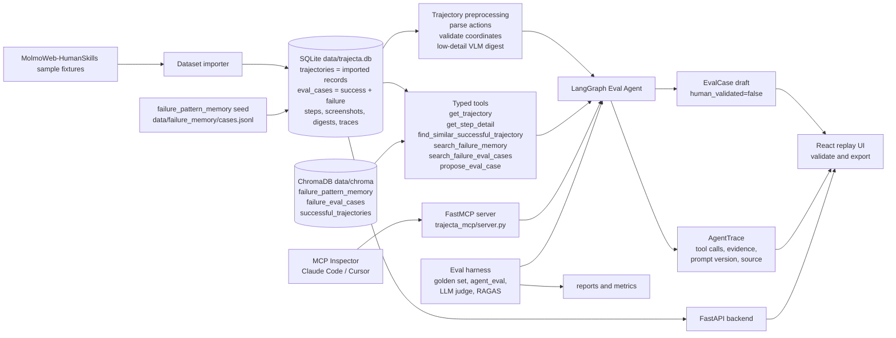

# Trajecta

Trajecta turns raw browser-agent trajectories into human-validated regression eval cases.

Trajecta is an AI-native Eval Agent for browser-agent trajectory evaluation. It imports recorded browser-agent trajectories, replays screenshots and actions, uses a LangGraph tool-calling agent to inspect suspicious steps, retrieves similar failures from ChromaDB, and produces eval case drafts that humans review before export.

This is not a browser-use agent. It does not control a live browser in v1.

## Presentation Guide

Use this README as the presentation entry point:

1. **Problem** - browser-control agents and trajectory datasets exist, but teams still need a repeatable way to diagnose recorded failures and turn them into regression eval cases.
2. **System architecture** - walk through the diagram below: imported trajectories, preprocessing, RAG, tool-calling Eval Agent, UI, MCP, and eval harness.
3. **UI demo** - import the bundled MolmoWeb sample, select a run, replay screenshots/actions, click `Analyze Trajectory`, inspect the trace, validate/export the draft.
4. **MCP demo** - show Trajecta as a remote callable composite tool through MCP Inspector or a coding-agent client.
5. **Experiments** - show the golden set, v1 to v5 prompt iteration, dual LLM judge agreement, RAGAS result, VLM cost savings, and pytest status.
6. **Boundaries** - v1 closes on trajectory evaluation only: no live browser control, no recorder middleware, no reviewer UI, no security benchmark, no v2 backlog work.

## Architecture



Core contracts live in [docs/contracts.md](docs/contracts.md). Behavior docs live in [docs/preprocessing.md](docs/preprocessing.md), [docs/eval_agent.md](docs/eval_agent.md), [docs/rag.md](docs/rag.md), [docs/api.md](docs/api.md), and [docs/architecture.md](docs/architecture.md).

Terminology note: `trajectory` is the canonical product term. Current public
API/tool names are now fully canonical (`trajectory_id`, `/api/trajectories`, `get_trajectory`, `trajectories` table). The word `run` survives only as `eval/runs/<timestamp>/`, one evaluation execution — not a trajectory.

## Quick Start

Backend:

```bash
cd backend
pip install -r requirements.txt
uvicorn app.main:app --reload
```

Frontend:

```bash
cd frontend
npm install
npm run dev
```

Open the Vite URL, then:

1. Click `Import Dataset` to load the bundled `data/raw/molmoweb_humanskills_sample/` fixture runs.
2. Select a trajectory from the left panel.
3. Replay screenshots, actions, observations, and coordinate validation.
4. Click `Analyze Trajectory` or `Analyze Selected Step`.
5. Review the Eval Agent trace, retrieved evidence, termination badge, and eval case draft.
6. Mark the reviewed draft validated, then export `eval_case.json`.

The app also runs cold without LLM credentials. When model env vars are unset, the backend uses deterministic mocks for the agent and VLM paths.

## Configuration

Local configuration is read from environment variables. Copy the template at the repo root, then edit secrets locally:

```bash
cp .env.example .env
```

Do not commit `.env`. Shell exports take precedence over the file. See [`.env.example`](.env.example) for the full variable list; the essentials are below.

```text
# Required for the real-LLM agent + VLM paths.
OPENAI_API_KEY=sk-...

# Tool-calling Eval Agent. Without this, OfflineAgentMock runs.
TRAJECTA_AGENT_MODEL=gpt-4o-mini

# Low-detail preprocessing VLM + high-detail get_step_detail VLM.
# Without this, MockVLMClient runs.
TRAJECTA_VLM_MODEL=gpt-4o-mini

# Optional: versioned Eval Agent prompt bundle.
TRAJECTA_PROMPT_VERSION=v1_minimal

# Optional: versioned high-detail VLM prompt bundle.
TRAJECTA_VLM_HIGH_DETAIL_PROMPT_VERSION=v1_task_context

# Optional: Phase 8 dual LLM judge config.
TRAJECTA_JUDGE_A_MODEL=<gemini-model-id>
TRAJECTA_JUDGE_A_PROMPT_VERSION=<judge-a-prompt-version>
TRAJECTA_JUDGE_B_MODEL=<openai-model-id>
TRAJECTA_JUDGE_B_PROMPT_VERSION=<judge-b-prompt-version>

# Optional: ChromaDB embedding model. Changing it requires rebuilding data/chroma/.
TRAJECTA_EMBEDDING_MODEL=text-embedding-3-small
```

Prompt updates are versioned directories under `prompts/eval_agent/`, `prompts/vlm_high_detail/`, and `prompts/judge/`. Create a new directory for each prompt change and roll back by setting the corresponding environment variable to a previous version. See [docs/prompt_versioning.md](docs/prompt_versioning.md).

Fallback behavior with no env vars set:

- `OfflineAgentMock` runs a deterministic 5-stage analysis script.
- `MockVLMClient` returns deterministic hash-derived summaries for low-detail and high-detail VLM calls.
- The default pytest suite exercises these offline paths.

Opt-in real LLM smoke:

```bash
OPENAI_API_KEY=sk-... TRAJECTA_AGENT_MODEL=gpt-4o-mini TRAJECTA_VLM_MODEL=gpt-4o-mini \
  pytest backend/tests/test_real_llm_integration.py -v
```

This test costs real OpenAI tokens and is not part of the default suite.

## Eval & Experiments

Trajecta's evaluation story has four pillars: a structured golden set, deterministic pytest coverage, RAGAS over recorded retrieval traces, and a dual LLM judge with Cohen's κ agreement. See [docs/testing.md](docs/testing.md), [docs/experiment_log.md](docs/experiment_log.md), and [docs/failure_analysis.md](docs/failure_analysis.md).

### Headline Results

| Area | Result |
| --- | --- |
| Golden set | 35 cases across 8 categories: allrecipes, amazon, apple, arxiv, booking, github, google_flight, huggingface |
| Best general prompt | `v3_balanced_rubric` at 80.6% binary verdict accuracy |
| Failure-sensitive prompt | `v5_constraint_verification` reached 100.0% failure recall and 78.6% step localization |
| Dual LLM judge | Gemini/OpenAI κ_LLM,LLM = 0.741 on 31 gradeable cases |
| RAGAS | real mode, n=10, faithfulness=0.4068, no ground-truth answers |
| Coarse-to-fine VLM | 91.5% visual-token cost savings in the formal v3 run |
| Test suite | Last recorded Phase 8 full sweep: 440 passed / 1 skipped |

### Golden Set

`eval/golden.jsonl` contains 35 cases built from `data/triage_notes.csv` with schema `{input, expected_facts, forbidden_facts, tags}`. Rebuild or check it with:

```bash
python scripts/build_golden_jsonl.py --check
```

### Agent-Quality Evaluation

```bash
cd backend
OPENAI_API_KEY=sk-... TRAJECTA_AGENT_MODEL=gpt-4o-mini TRAJECTA_VLM_MODEL=gpt-4o-mini \
  python -m app.agent_eval --trace-dir eval/runs/$(date -u +%Y-%m-%dT%H-%M-%SZ)/traces
```

Produces `eval/agent_report.{json,md}` plus per-sample trace JSONs under the `--trace-dir`. Both `eval/agent_report.*` and `eval/runs/` are reproducible local artefacts and are `.gitignore`d.

`agent_eval` retries transient provider failures per sample: 429, rate limit, timeout, and connection errors retry up to 3 times by default. Tune with `--max-retries`, `--retry-base-s`, and `--retry-max-s`.

Resume an interrupted formal eval with the same trace dump directory:

```bash
TRAJECTA_PROMPT_VERSION=v3_balanced_rubric \
python -m backend.app.agent_eval \
  --trace-dir eval/runs/2026-05-30T03-54-45Z/traces
```

Existing `{trajectory_id}.json` traces are reused and not billed again. The prompt version must match the trace metadata; mismatches fail fast to avoid mixing outputs from different prompt versions.

### Prompt Iteration

The formal Phase 8 v1 to v5 comparison uses 31 filtered golden-set samples with `gpt-5.4-mini-2026-03-17` for both the Eval Agent and VLM.

| Round | Prompt | Change | Metric delta | Conclusion |
| --- | --- | --- | --- | --- |
| 1 | `v1_minimal` | Minimal failure-shape instructions, no rubric. | Baseline binary accuracy 74.2%; success recall 58.8%; failure recall 92.9%. | Strong failure sensitivity, but too many successful trajectories are marked failed. |
| 2 | `v2_success_rubric` | Add explicit success-shape rubric. | Binary accuracy +3.2 pp; success recall +29.4 pp; failure recall -28.6 pp. | Success hallucinations drop, but the prompt becomes too conservative on failures. |
| 3 | `v3_balanced_rubric` | Balance success/failure criteria and tighten stop conditions. | Binary accuracy +3.2 pp vs v2; mean tool calls -0.68; latency -1.50 s. | Best headline accuracy at 80.6% with lower tool use. |
| 4 | `v4_search_strategy_rubric` | Clarify successful-run retrieval vs failure-memory retrieval. | Binary accuracy -6.5 pp; failure-type accuracy rises to 57.1%. | Retrieval guidance helps the advisory failure-type signal, not the headline metric. |
| 5 | `v5_constraint_verification` | Emphasize constraint evidence and failure verification. | Binary accuracy -6.5 pp; failure recall +14.3 pp to 100.0%; success recall -23.5 pp. | Best for catching failures, but not the best general prompt. |

The best headline prompt is `v3_balanced_rubric`:

| Metric | Value |
| --- | --- |
| Binary verdict accuracy | 80.6% |
| Failure-verdict recall | 85.7% |
| Success-verdict recall | 76.5% |
| Mean tool calls / run | 1.68 |
| Mean wall-clock latency / run | 9.96 s |
| Total cost (31 runs) | $1.022 |
| Coarse-to-fine VLM savings | 91.5% |

The v5 prompt is intentionally failure-sensitive: failure recall reaches 100.0%, but success recall drops to 41.2%. Full per-round metrics and caveats are in [docs/experiment_log.md](docs/experiment_log.md).

### Dual LLM Judge

```bash
python -m backend.app.agent_eval \
  --trace-dir eval/runs/{timestamp}/traces \
  --judge
```

The judge scores one binary dimension: `acceptable_eval_case`, meaning whether the generated draft is acceptable as a reusable regression case. Judge A uses a Gemini-compatible provider/model configured by `TRAJECTA_JUDGE_A_MODEL`; Judge B uses an OpenAI-compatible provider/model configured by `TRAJECTA_JUDGE_B_MODEL`.

For the v5 judge run, Judge A (`gemini-3.1-flash-lite`) accepted 13 / 31 drafts and Judge B (`gpt-5.4-mini-2026-03-17`) accepted 15 / 31. The agreement target is met: κ_LLM,LLM = 0.741 on the full 31-case set.

Standalone judge rerun/debug path:

```bash
python -m eval.judge \
  --golden eval/golden.jsonl \
  --report eval/agent_report.json \
  --trace-dir eval/runs/{timestamp}/traces \
  --out eval/judge_report.json
```

Human second-judge workflow and reviewer UI are intentionally not part of V1.

### RAGAS

```bash
python -m backend.app.ragas_eval --trace-dir eval/runs/{timestamp}/traces --limit 10
```

RAGAS reads recorded RAG tool queries and their matching retrieved contexts from the selected trace dump, then falls back to the SQLite `traces` table only when a dump is missing. It produces `eval/ragas_report.{json,md}` with no-ground-truth retrieval-grounded `faithfulness`; it is not an answer-correctness or human ground-truth evaluation.

Latest Phase 8 A6 run: `mode=real`, `n=10`, `ground_truth_source=none`, `faithfulness=0.4068`.

### Tests

```bash
cd backend
pytest
```

The last recorded Phase 8 full sweep in [docs/phase8_s18_alignment.md](docs/phase8_s18_alignment.md) is `440 passed / 1 skipped`. Frontend TypeScript build was also verified during Phase 8:

```bash
cd frontend
npm run build
```

## MCP Connection

MCP shipped in Phase 8 B1 and the live-client smoke is complete: the server has been verified with MCP Inspector. The server exposes the entire Eval Agent as one composite tool so external coding agents can diagnose a browser-agent trajectory via one MCP call.

The server uses the standalone `fastmcp` package, pinned in `backend/requirements.txt`. Tool registration is decorator-based and JSON schemas are auto-derived from Python type hints.

### MCP Inspector Smoke Test

From the repo root, with backend dependencies installed in the active Python environment:

```bash
npx @modelcontextprotocol/inspector python trajecta_mcp/server.py
```

Manual acceptance:

1. Connect succeeds.
2. Tools tab lists exactly six tools: `list_trajectories`, `get_trajectory`, `get_step_detail`, `search_failure_memory`, `search_failure_eval_cases`, `analyze_trajectory`.
3. `list_trajectories` returns imported Trajecta runs.
4. `analyze_trajectory` returns an `eval_case_draft` and an `agent_trace`.
5. The returned trace has `agent_trace.source == "mcp"`.
6. Excluded mutation/admin tools are absent.

### Claude Code / Cursor

Add `trajecta_mcp/server.py` to the client's MCP config:

```json
{
  "mcpServers": {
    "trajecta": {
      "command": "python",
      "args": ["trajecta_mcp/server.py"],
      "cwd": "<path to Trajecta repo>"
    }
  }
}
```

Demo conversation:

```text
You: List my Trajecta runs.
Client: <calls trajecta.list_trajectories(), picks a failed sample>
You: Why did this booking run fail?
Client: <calls trajecta.analyze_trajectory(trajectory_id)>
        <Trajecta runs digest -> step inspection -> RAG retrieval -> propose_eval_case>
        <returns EvalCase draft + AgentTrace>
You: <open the Trajecta UI to validate the draft>
```

The MCP surface deliberately excludes `save_validated_eval_case`, `delete_*`, `import_dataset`, and `set_prompt_version`. Validation stays HITL-gated in the Trajecta UI. Full design: [docs/mcp.md](docs/mcp.md); governance boundary: [docs/security_governance.md](docs/security_governance.md).

## Example Eval Case

```json
{
  "case_id": "ec_run_001_step_3",
  "source_trajectory_id": "run_001",
  "task": "Find a hotel under $200 with free parking.",
  "failure_step": 3,
  "failure_type": "missed_constraint",
  "expected_behavior": "The agent should verify price and free parking before selecting a hotel.",
  "actual_behavior": "The agent selected a hotel without verifying the free parking constraint.",
  "evidence": [
    {
      "claim": "Step 3 selected a hotel result.",
      "source": "step_detail_high",
      "trajectory_id": "run_001",
      "step_index": 3,
      "trace_event_seq": 4,
      "context_id": null
    },
    {
      "claim": "No inspected step verified free parking before selection.",
      "source": "trajectory",
      "trajectory_id": "run_001",
      "step_index": null,
      "trace_event_seq": null,
      "context_id": null
    },
    {
      "claim": "Failure memory fm_missed_constraint_001 describes agents selecting an item before checking a required constraint.",
      "source": "failure_memory",
      "trajectory_id": null,
      "step_index": null,
      "trace_event_seq": 6,
      "context_id": "fm_missed_constraint_001"
    }
  ],
  "regression_rule": "Pass only if the selected hotel satisfies both the price and free parking constraints.",
  "retrieved_context_ids": ["fm_missed_constraint_001"],
  "human_validated": true
}
```

## V1 Status

V1 / Phase 8 is closed. The shipped surface includes local fixture import, screenshot replay, deterministic preprocessing, coarse-to-fine VLM, a bounded LangGraph Eval Agent, ChromaDB retrieval, human validation/export, pytest coverage, real RAGAS, a dual LLM judge, MCP Inspector-verified MCP access, and presentation-ready docs.

Current non-goals:

- No live browser control.
- No recorder middleware.
- No human second judge or reviewer UI.
- No Spotlighting security benchmark.
- No `skills/create-eval-case/SKILL.md`.
- No v2/backlog implementation in this closeout.

Longer-form project docs:

- [PROJECT.md](PROJECT.md) - product and design decisions.
- [docs/architecture.md](docs/architecture.md) - system architecture and repository layout.
- [docs/phase8_s18_alignment.md](docs/phase8_s18_alignment.md) - final Phase 8 tracker.
- [docs/testing.md](docs/testing.md) - test and eval protocol.
- [docs/experiment_log.md](docs/experiment_log.md) - prompt iteration results.
- [docs/mcp.md](docs/mcp.md) - MCP composite design and Inspector smoke test.
