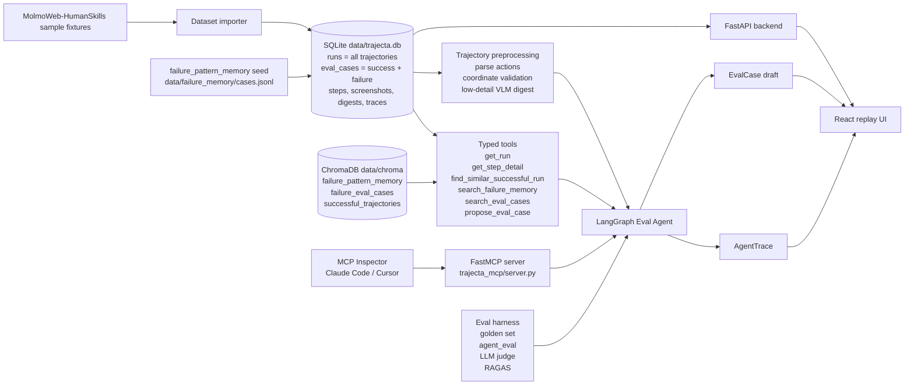

# Architecture

## Recommended Tech Stack

### Backend

- Python
- FastAPI
- Pydantic
- LangGraph
- ChromaDB
- pytest
- RAGAS

### Frontend

- React
- TypeScript
- Vite
- Tailwind

### AI

- OpenAI-compatible LLM/VLM API
- Structured JSON outputs enforced by tool signatures (no free-form JSON parsing)
- Function tools as the agent's only interface to the run, RAG, and final output
- Multi-resolution VLM: low-detail (~85 tokens/image) for preprocessing, high-detail (~1500 tokens/image) on demand
- Prompt layout keeps the stable prefix (system prompt + trajectory digest) before dynamic tool-calling turns, so a caching-capable provider benefits transparently. v1 does not depend on cache discounts and does not wire provider-specific cache controls.
- Embeddings for failure-memory and eval-case RAG

Configuration:

- Load configuration from environment variables. Local development may use
  `backend/.env`, which must not be committed.
- `OPENAI_API_KEY`: required only when real LLM/VLM calls are enabled
- `OPENAI_BASE_URL`: optional override for OpenAI-compatible providers
- `TRAJECTA_AGENT_MODEL`: tool-calling Eval Agent model
- `TRAJECTA_VLM_MODEL`: vision model for screenshot summaries
- `TRAJECTA_PROMPT_VERSION`: committed prompt bundle under `prompts/eval_agent/`; defaults to `v1_minimal`
- `TRAJECTA_VLM_HIGH_DETAIL_PROMPT_VERSION`: committed high-detail VLM prompt under `prompts/vlm_high_detail/`; defaults to `v1_task_context`
- `TRAJECTA_EMBEDDING_MODEL`: embedding model for ChromaDB indexing
- `TRAJECTA_CHROMA_DIR`: ChromaDB persistence directory; defaults to `data/chroma/`

Changing `TRAJECTA_EMBEDDING_MODEL` requires clearing and rebuilding persisted
ChromaDB collections or using model-specific collection names.

Tests and local fixtures must not require network calls. If API credentials are
missing, use deterministic mocked LLM/VLM summaries and agent outputs.

### Data

- Source dataset: `allenai/MolmoWeb-HumanSkills`
- Use only a small sampled subset in v1
- Do not require full dataset download

## System Boundaries

Trajecta is an Eval Agent for browser-use agent trajectories. It imports existing trajectory data, displays the trajectory, analyzes failures, retrieves failure pattern memory and failure EvalCases, and drafts regression eval cases.

Trajecta does not control a live browser in v1. It does not include CDP, Playwright recorder middleware, OS-level computer-use support, video replay, multi-user auth, OpenTelemetry integration, SaaS features, or automatic root-cause claims without human review.

## System Diagram



The MCP path is a remote interface to the same in-process Eval Agent loop.
It was verified with MCP Inspector for the V1 closeout. The eval harness is
not a product feature; it is the project-quality measurement layer used for
the presentation.

Terminology note: `trajectory` is the canonical term. Current public API/tool
names such as `run`, `run_id`, `/api/runs`, and `get_run` remain
legacy-compatible names for trajectories until a later migration.

## Repository Structure

```text
trajecta/
  README.md
  PROJECT.md
  AGENTS.md
  backend/
    app/
      main.py
      schemas.py
      storage.py
      ids.py
      llm.py
      dataset_importer.py
      coordinate_validator.py
      preprocess.py
      tools.py
      eval_agent_graph.py
      rag.py
      ragas_eval.py
    tests/
      test_schema.py
      test_importer.py
      test_preprocess.py
      test_tools.py
      test_rag.py
      test_eval_agent.py
      test_eval_case.py
      test_coordinates.py
      test_api.py
    requirements.txt
  frontend/
    package.json
    src/
      App.tsx
      components/
        RunList.tsx
        StepTimeline.tsx
        ScreenshotViewer.tsx
        StepDetailPanel.tsx
        EvalAgentPanel.tsx
        ObservationSummaryPanel.tsx
        EvalCaseDraft.tsx
  data/
    raw/
      molmoweb_humanskills_sample/
        run_status_overlay.json
    trajecta.db                          # SQLite: runs (all trajectories),
                                         # eval_cases (success + failure),
                                         # steps, screenshots (BLOB),
                                         # digests, traces, failure_memory
    failure_memory/
      cases.jsonl                        # human-edited seed corpus; hydrated into DB on load
    chroma/                              # vector store (separate persistent layer)
  trajecta_mcp/
    server.py
  eval/
    ragas_report.json
    ragas_report.md
```

`data/trajecta.db` is a single SQLite file managed by SQLAlchemy 2.0 (sync,
declarative models in `backend/app/models.py`). Schema is owned by Alembic
(`backend/alembic/versions/`); the app also calls `Base.metadata.create_all`
on startup so a fresh checkout boots without a manual `alembic upgrade head`.
Screenshots live as BLOB rows on the `screenshots` table rather than as files
on disk — this keeps the deployable surface to one file + the `chroma/`
directory and one `failure_memory/cases.jsonl` seed.

Module responsibilities:

- `db.py`: SQLite engine + `session_scope()` context manager; honors `TRAJECTA_DATA_DIR`.
- `models.py`: SQLAlchemy declarative ORM (Run, Step, Screenshot, Digest, Trace, EvalCaseRow, FailureMemoryRow).
- `storage.py`: Pydantic ↔ ORM translation; public signatures stable across the filesystem → SQLite cutover. Each function opens its own session_scope.
- `ids.py`: generate stable eval-case IDs and check collisions through storage.
- `llm.py`: centralize LLM/VLM client creation, provider configuration, and deterministic offline mocks. Takes screenshot **bytes** (not paths) so the BLOB-backed storage layer flows through unchanged.
